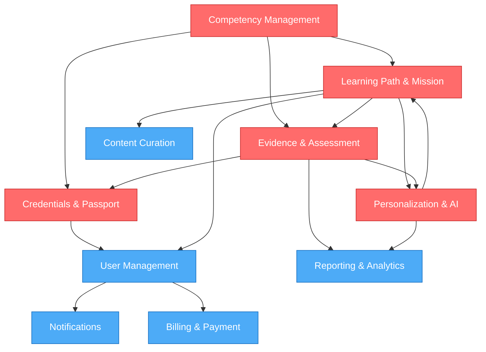

# Core Domains

## Domains, Subdomains, and Strategic Classification

Using Domain-Driven Design (DDD) principles, we classify the SkillForge ecosystem into operational domains that will shape bounded context design, team structure, and technical architecture.

## Domain Classification Framework

### Core Domain
**Where SkillForge creates unique, irreplaceable value.** Investment here directly differentiates SkillForge from competitors. Core domains require top engineering talent and strategic focus.

### Supporting Domain
**Necessary for operations but not differentiating.** Can be outsourced, built with standard patterns, or acquired. Supporting domains prevent core domains from being slowed by commodity concerns.

### Generic Domain
**Standard, well-understood problems with proven solutions.** Should be bought or outsourced unless there's strategic reason to build. Examples: authentication, email, payment processing.

---

## Core Domains (Strategic Investment)

### 1. Competency Management (CORE)

**Purpose**
Design, structure, and evolve competency frameworks. Define what skills and competencies exist, how they relate, their prerequisites, and their mastery levels.

**Why Core**
- Differentiates SkillForge from traditional LMS
- Requires deep educational and market research
- Directly impacts every other domain (learning, assessment, credentials)
- Competitive advantage is built here

**Responsibilities**
- Design competency hierarchies (competency → skills → sub-skills)
- Define mastery levels and progression criteria
- Model prerequisites and dependencies
- Create industry-standard competency frameworks (developer, designer, manager, etc.)
- Adapt frameworks for regional contexts and industries
- Version and evolve frameworks as markets change

**Owned Entities**
- Competency
- Skill
- SkillGraph
- MasteryLevel
- CompetencyFramework
- SkillPrerequisite
- SkillDependency

**Key Decisions**
- How granular should skills be? ("JavaScript" vs. "Array Methods")
- Are competencies industry-specific or universal?
- How are levels defined? (Time-based, output-based, or hybrid?)
- How are prerequisites enforced? (Soft recommendations vs. hard gates?)

---

### 2. Learning Path & Mission Design (CORE)

**Purpose**
Create coherent learning sequences that guide learners from current state to competency mastery. Missions bundle resources, projects, and assessments into achievable, time-bound units.

**Why Core**
- Directly impacts learner outcomes and engagement
- Requires expertise in pedagogy, project-based learning, and AI personalization
- Generates the evidence that differentiates SkillForge from competitors
- Every learner journey begins here

**Responsibilities**
- Design learning missions aligned to specific competencies
- Curate and link learning resources (videos, articles, tutorials)
- Structure projects as primary evidence generators
- Create adaptive learning paths based on learner goals, pace, and style
- Integrate AI recommendations for personalization
- Define progression criteria and advancement rules
- Support multiple learning styles (hands-on, visual, reading, mentorship)

**Owned Entities**
- LearningPath
- LearningMission
- Module
- Lesson
- Resource
- Project
- LearningObjective
- PersonalizationProfile
- AdaptiveRule

**Key Decisions**
- How long should missions be? (1 week, 1 month?)
- What ratio of content to projects?
- How much AI personalization vs. structured sequences?
- Are paths mandatory sequences or pick-and-choose?
- How do learners access resources (linear, non-linear, or branching)?

---

### 3. Evidence & Assessment (CORE)

**Purpose**
Collect, evaluate, and validate evidence that learners have demonstrated competency. Assessment is continuous, not episodic, and grounded in real artifacts (projects, peer reviews, expert evaluation).

**Why Core**
- Employer trust depends on evidence quality and credibility
- Differentiates from traditional testing and exam-based credentials
- Feedback loop directly impacts learning outcomes
- Assessment data drives all credentials and career recommendations

**Responsibilities**
- Design rubrics for project and performance evaluation
- Manage assessment workflow (submission, review, feedback)
- Collect and curate evidence artifacts
- Define mastery criteria for each competency
- Provide feedback mechanisms (automated and instructor)
- Track assessment history and progression
- Support peer and self-assessment
- Validate evidence for credential issuance

**Owned Entities**
- Assessment
- Evidence
- EvidenceArtifact
- Rubric
- MasteryGate
- EvidenceCollection
- Feedback
- PeerReview
- CompetencyVerification

**Key Decisions**
- What counts as valid evidence? (Projects only? Peer review? Test scores?)
- Who can assess? (Instructors only? Peers? AI?)
- How is evidence weighted and aggregated?
- How long is evidence valid? (Forever or time-limited?)
- What privacy protections apply to evidence?

---

### 4. Personalization & AI Guidance (CORE)

**Purpose**
Deliver individualized learning experiences through AI-powered recommendations, adaptive paths, and intelligent guidance. Personalization is what makes SkillForge scale without losing effectiveness.

**Why Core**
- AI is a primary value proposition for learners
- Requires sophisticated ML models, not just algorithms
- Directly impacts engagement, completion, and outcomes
- Competitive advantage through better recommendations

**Responsibilities**
- Build learner profiles from behavior, assessment, and preference data
- Generate personalized learning path recommendations
- Provide mission and project suggestions
- Offer adaptive pacing and difficulty adjustment
- Generate AI-assisted feedback and explanations
- Surface career pathway recommendations
- Predict skill gaps and suggest remediation
- Support both short-term (next mission) and long-term (career) planning

**Owned Entities**
- LearnerProfile
- PersonalizationPreference
- LearningStyle
- CareerGoal
- SkillGap
- Recommendation
- AIGuidance
- AdaptiveSequence
- PredictiveInsight

**Key Decisions**
- What data informs personalization? (Activity, assessment, demographics, preferences?)
- How transparent should recommendations be to learners?
- How do we avoid filter bubbles or limited opportunity exposure?
- Can learners opt out of personalization?
- How do we balance diversity of learning experiences with performance?

---

### 5. Credentials & Skill Passport (CORE)

**Purpose**
Issue, manage, and present verified credentials (certificates, badges, skill endorsements) that employers and peers can trust. The Skill Passport is the learner's portable, lifelong professional profile.

**Why Core**
- Directly creates market value (employer trust and hiring outcomes)
- Requires deep security, cryptographic, and verification infrastructure
- Learner ownership and portability are competitive differentiators
- Future revenue model depends on credential value

**Responsibilities**
- Design credential types (certificates, badges, skill endorsements)
- Define credential issuance criteria (evidence-based)
- Manage credential lifecycle (issue, revoke, expire)
- Provide portable credential formats (standards-based, DID-ready)
- Create and maintain Skill Passport interface
- Enable employer verification of credentials
- Support credential sharing (social, job applications, portfolios)
- Handle credential privacy and learner control

**Owned Entities**
- Credential
- SkillPassport
- CredentialBadge
- Certificate
- SkillEndorsement
- CredentialVerification
- PortableCredential
- CredentialIssuer

**Key Decisions**
- What credential types? (How granular?)
- What evidence triggers issuance?
- Do credentials expire or have lifetime validity?
- Are credentials on-platform only or portable (blockchain/DID)?
- Who can issue credentials? (SkillForge only? Partners?)
- What privacy controls does the learner have?

---

## Supporting Domains (Necessary, Not Differentiating)

### 6. User Management & Identity

**Purpose**
Manage learner, instructor, and administrator profiles, authentication, authorization, and role-based access control.

**Why Supporting**
- Essential but well-understood problem
- No competitive advantage in user management
- Can follow standard patterns

**Owned Entities**
- User (Learner, Instructor, Administrator)
- UserRole
- Permission
- AuthenticationCredential
- UserProfile

---

### 7. Notifications & Communication

**Purpose**
Deliver timely, relevant notifications to learners, instructors, and administrators via email, SMS, in-app, and push channels.

**Why Supporting**
- Commodity functionality
- Standard implementation patterns exist
- Channels (email, SMS) are likely third-party services

**Owned Entities**
- Notification
- NotificationPreference
- Message
- MessageTemplate

---

### 8. Content Curation & Repository

**Purpose**
Manage the repository of learning resources (videos, articles, tutorials, documentation) and curate which resources are linked to which skills and missions.

**Why Supporting**
- Content management is well-understood (CMS patterns)
- Value is in curation strategy and learner integration, not content tech
- Can use or adapt existing CMS platforms

**Owned Entities**
- Resource
- ResourceType
- ResourceMetadata
- ResourceLink
- ContentCatalog

---

### 9. Reporting & Analytics

**Purpose**
Provide insights into learner progress, instructor effectiveness, platform usage, and business metrics.

**Why Supporting**
- Standard analytics patterns (data warehouse, BI tools)
- Valuable but not differentiating
- Many third-party solutions (Mixpanel, Google Analytics, etc.)

**Owned Entities**
- Metric
- Report
- Dashboard
- LearningOutcome
- EngagementMetric

---

### 10. Billing & Payment

**Purpose**
Manage subscriptions, payments, invoicing, and financial transactions (future phase).

**Why Supporting**
- Commodity domain
- Third-party payment processors handle core complexity
- Can integrate Stripe, PayPal, or local payment providers

---

## Generic Domains (Buy or Outsource)

### 11. Authentication & Security

**How to Handle**
- Use OAuth 2.0, OpenID Connect, or similar standards
- Integrate with identity providers (Google, Microsoft, future local providers)
- Implement TOTP or SMS for 2FA
- Consider Auth0, Firebase, or similar managed services

---

### 12. Email & SMS Delivery

**How to Handle**
- Use SendGrid, Twilio, or similar managed services
- Never build custom mail servers
- Focus on template design and notification triggers, not delivery infrastructure

---

### 13. File Storage & Asset Management

**How to Handle**
- Use cloud object storage (S3, GCS, Azure Blob)
- Focus on access control and metadata, not infrastructure
- Consider CDN for performance

---

### 14. Search & Discovery

**How to Handle**
- Use managed search (Elasticsearch, Algolia, or database full-text search)
- Build domain-specific search logic (skill discovery, competency search, resource search)
- Focus on UX and ranking, not search engine development

---

## Domain Interactions & Dependencies

## Team Organization Implications

The domain structure suggests the following team organization:

| Team | Domains | Type | Size |
|------|---------|------|------|
| **Competency & Frameworks** | Competency Management | Core | 2-3 |
| **Learning Experience** | Learning Path & Mission | Core | 4-5 |
| **Assessment & Evidence** | Evidence & Assessment | Core | 3-4 |
| **AI & Personalization** | Personalization & AI Guidance | Core | 4-6 |
| **Credentials & Verification** | Credentials & Skill Passport | Core | 2-3 |
| **Platform Infrastructure** | User, Content, Analytics, Payments | Supporting | 3-4 |
| **Communications** | Notifications | Supporting | 1-2 |

---

## Evolution Over Five Years

As SkillForge evolves, new domains will emerge:

**Year 1-2: Foundational**
- Focus entirely on Core domains
- Minimize Supporting domain complexity
- Buy or outsource Generic domains

**Year 2-3: Organization Domain**
- Add Organizational Learning Management
- Add Role-based learning path customization
- Employer integration becomes strategic

**Year 3-4: Talent Matching**
- Employer recruitment and matching
- Job marketplace integration
- Career outcome tracking

**Year 4-5: Ecosystem**
- Partner integrations
- Credential marketplaces
- Regional competency governance

---

## Next Steps

1. Validate domain classifications with business stakeholders
2. Assign domain owners and core team members
3. Proceed to **Phase 2: Bounded Contexts** (03-BOUNDED_CONTEXTS.md)
4. Design API contracts between domains
5. Define communication patterns and event flows

---

*This document provides the domain structure for all technical decisions going forward. Update when strategic priorities shift or new market opportunities emerge.*