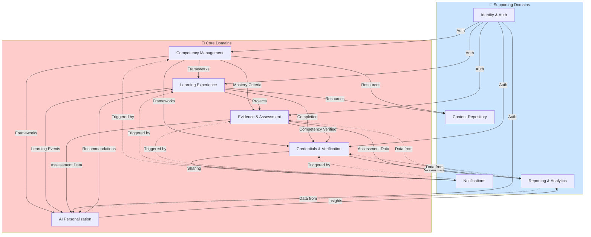
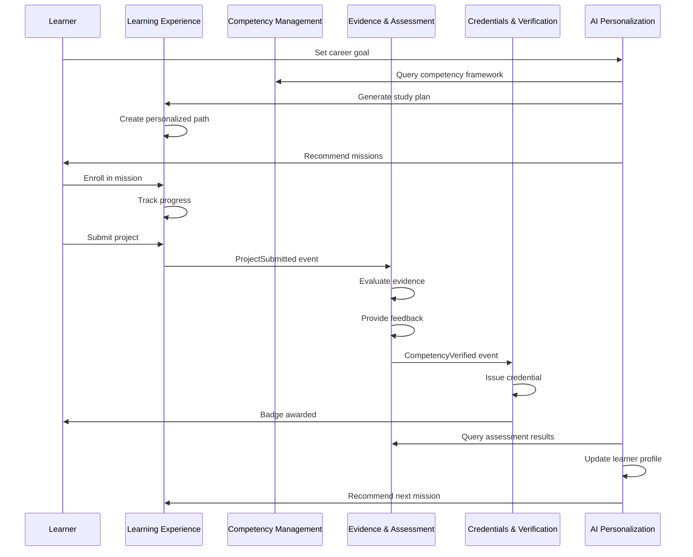
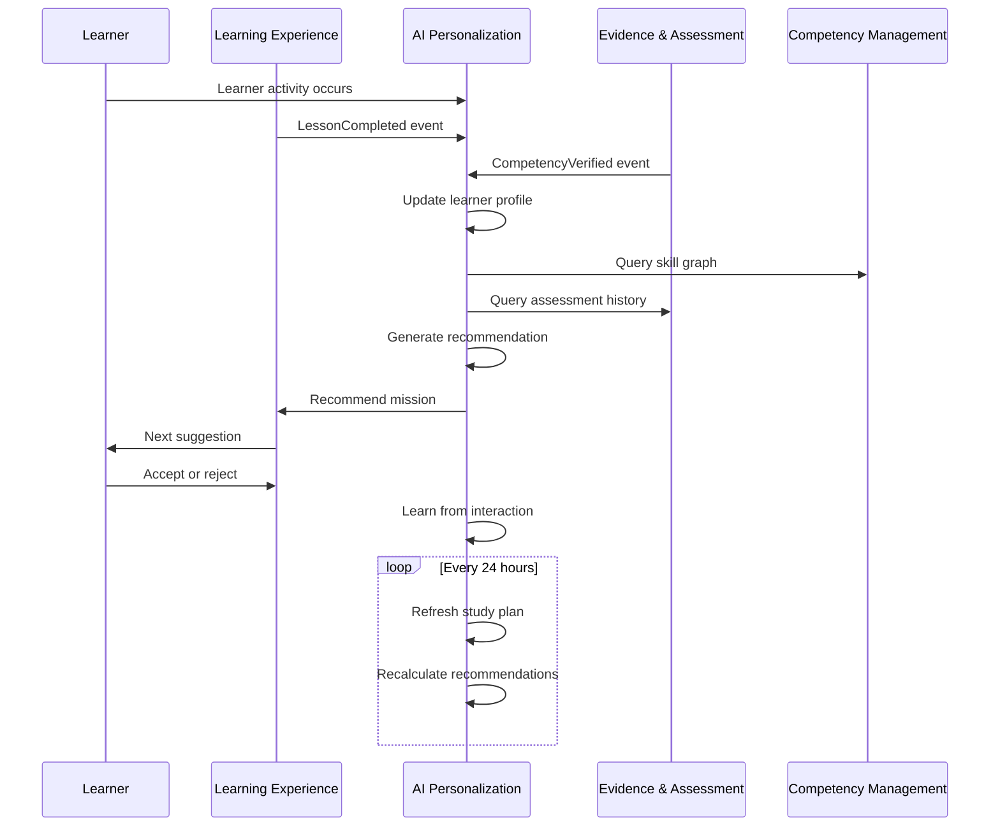
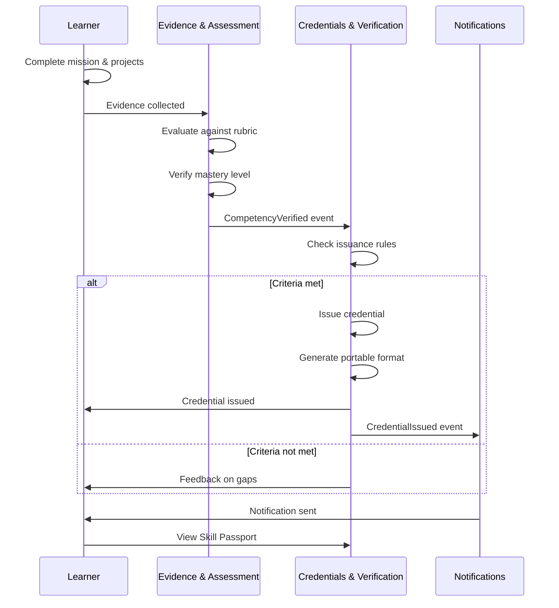

# Bounded Contexts & Domain Events

**Version**: 1.0  
**Author**: SkillForge Architecture  
**Last Reviewed**: Sprint 0  
**Review Status**: Approved  

---

## Overview

This document defines the operational boundaries, communication contracts, and event flows within SkillForge using Domain-Driven Design (DDD) principles. Each bounded context is an independent, self-contained domain with clear responsibilities, owned entities, and explicit interfaces with other contexts.

**Key Principles**:
- Each context owns its entities and business logic
- Contexts communicate through well-defined events and commands
- Events are asynchronous; commands may be synchronous or asynchronous
- No shared databases; contexts own their data
- This document is implementation-independent and language-agnostic

---

## Bounded Contexts at a Glance

| Context | Type | Purpose | Key Entities |
|---------|------|---------|--------------|
| **Identity & Authentication** | Supporting | Manage user identity, roles, permissions | User, Profile, Role, Credential |
| **Competency Management** | Core | Define and evolve skill frameworks | Competency, Skill, SkillGraph, MasteryLevel |
| **Learning Experience** | Core | Design and deliver learning missions | LearningPath, Mission, Module, Lesson |
| **Evidence & Assessment** | Core | Collect and validate competency proof | Evidence, Assessment, Rubric, Feedback |
| **AI Personalization** | Core | Recommend and adapt learning | LearnerProfile, Recommendation, Study Plan |
| **Credentials & Verification** | Core | Issue and verify portable credentials | Credential, Badge, Certificate, SkillPassport |
| **Content Repository** | Supporting | Manage learning resources | Resource, Catalog, Metadata |
| **Notifications** | Supporting | Deliver timely communications | Notification, Message, Schedule |
| **Reporting & Analytics** | Supporting | Provide insights into platform usage | Metric, Report, Dashboard |

---

# Core Bounded Contexts

## 1. Identity & Authentication Context

### Purpose

Manage user identity, authentication, authorization, role-based access control, and user profiles. This context is the single source of truth for "who is using the platform and what can they do?"

### Responsibilities

- Authenticate users via email, social login, and future federated identity
- Authorize actions based on roles and permissions
- Manage user profiles (learner, instructor, admin)
- Track user preferences and settings
- Support account recovery and security operations

### Owned Entities

- **User**: Individual platform user (Learner, Instructor, Administrator)
- **UserRole**: Role assignment (Learner, Instructor, Admin, Organization Manager)
- **Permission**: Granular action permissions (e.g., "SubmitEvidence", "AssessProject", "IssueBadge")
- **AuthenticationCredential**: Login credentials, API tokens, OAuth tokens
- **UserProfile**: Extended user information (bio, preferences, settings, avatar)
- **SecurityLog**: Audit trail of authentication and authorization events

### Ubiquitous Language

**User**: An authenticated individual with one or more roles on SkillForge  
**Learner**: A user pursuing competencies and collecting evidence  
**Instructor**: A user creating missions and assessing learner evidence  
**Administrator**: A user managing platform configuration  
**Role**: A named collection of permissions (e.g., "Learner", "Instructor")  
**Permission**: An atomic action authorization (e.g., "SubmitEvidence")  
**Authentication**: Verification of user identity  
**Authorization**: Determination of user permissions  

### Dependencies

- **Outbound**: Notifies other contexts of user registration, login, role changes
- **Inbound**: Receives requests for user information from all other contexts

### External Interactions

- **Email Service**: Sends password resets, account confirmations
- **OAuth Providers**: Google, Microsoft, future local providers
- **SMS Service**: Optional 2FA delivery
- **Audit System**: Logs all security events

### Scalability Considerations

- Authentication should be stateless and cacheable
- User profiles may be cached with short TTL
- Permission checks should be performant (avoid N+1 queries)
- Audit logs require efficient retention and archival
- Support rate limiting on login attempts

### Independent Service Boundary

- Authentication is synchronous and time-critical
- Can operate independently; other services degrade gracefully if Identity is unreachable
- Provides a simple query API for user lookup and permission checking

---

### Domain Events Published

```
UserRegistered
- user_id
- email
- timestamp

UserLoggedIn
- user_id
- timestamp
- login_method

UserProfileUpdated
- user_id
- updated_fields
- timestamp

RoleAssigned
- user_id
- role
- assigned_by
- timestamp

RoleRemoved
- user_id
- role
- removed_by
- timestamp

PermissionGranted
- user_id
- permission
- timestamp

PermissionRevoked
- user_id
- permission
- timestamp

AccountSuspended
- user_id
- reason
- suspended_by
- timestamp

AccountReactivated
- user_id
- reactivated_by
- timestamp
```

### Domain Events Consumed

```
None (Identity is foundational; other contexts depend on it)
```

### Commands Accepted

```
RegisterUser(email, password, full_name, language_preference)
LoginUser(email, password)
UpdateUserProfile(user_id, fields)
AssignRole(user_id, role, assigned_by)
RemoveRole(user_id, role, removed_by)
GrantPermission(user_id, permission)
RevokePermission(user_id, permission)
SuspendAccount(user_id, reason)
ReactivateAccount(user_id)
RequestPasswordReset(email)
ResetPassword(token, new_password)
```

### Queries Exposed

```
GetUser(user_id) -> User
GetUserByEmail(email) -> User
GetUserProfile(user_id) -> UserProfile
GetUserRoles(user_id) -> List<Role>
GetUserPermissions(user_id) -> List<Permission>
CheckPermission(user_id, permission) -> Boolean
GetUserPreferences(user_id) -> Preferences
ListActiveUsers(organization_id) -> List<User>
```

---

## 2. Competency Management Context

### Purpose

Define, structure, and evolve competency frameworks that drive all learning, assessment, and credential decisions. This context is the "source of truth" for what skills exist, how they relate, and how they're mastered.

### Responsibilities

- Design competency hierarchies (competencies → skills → sub-skills)
- Define mastery levels and progression criteria
- Model prerequisites and skill dependencies
- Create and maintain industry-standard frameworks (developer, designer, manager, etc.)
- Adapt frameworks for regional contexts and industries
- Version frameworks as markets evolve

### Owned Entities

- **Competency**: A demonstrated ability in a specific domain (e.g., "Web Development")
- **Skill**: An atomic, measurable capability (e.g., "HTML Fundamentals")
- **SubSkill**: Granular decomposition of a skill
- **SkillGraph**: DAG of skill relationships and dependencies
- **MasteryLevel**: Progression stages (Awareness, Familiarity, Proficiency, Expertise, Mastery)
- **Prerequisite**: Skill X must be mastered before Skill Y
- **CompetencyFramework**: Named collection of competencies (e.g., "Backend Engineer", "Product Manager")
- **FrameworkVersion**: Timestamped snapshots of framework evolution

### Ubiquitous Language

**Competency**: A demonstrated ability to apply skills in a real-world context  
**Skill**: An atomic, measurable capability that contributes to competencies  
**Mastery**: Complete proficiency where learner can teach, mentor, and innovate  
**Mastery Level**: A progression stage from Awareness through Mastery  
**Framework**: A named collection of related competencies for a career path  
**Prerequisite**: A skill that must be mastered before attempting dependent skills  
**Skill Graph**: The interconnected model of all skills and their relationships  

### Dependencies

- **Outbound**: Publishes framework changes; learning experiences depend on it
- **Inbound**: Receives change requests from stakeholders; responds to queries from Learning Experience, Assessment, and AI Personalization contexts

### External Interactions

- **Subject Matter Experts**: Provide framework feedback and refinement
- **Employer Partners**: Validate frameworks against job market needs
- **Analytics**: Provides usage data for framework evolution
- **Documentation**: Frameworks are published for external reference

### Scalability Considerations

- Frameworks are read-heavy; cache aggressively
- Skill graphs may be complex; precompute traversals and transitive closure
- Version control is critical; support point-in-time queries
- Framework changes should not immediately invalidate existing learner paths
- Support A/B testing of competing framework versions

### Independent Service Boundary

- Competency Management is primarily read-intensive after initial design
- Can operate independently; failures affect new path creation but not active learning
- Provides immutable snapshots for point-in-time reference

---

### Domain Events Published

```
CompetencyFrameworkCreated
- framework_id
- framework_name
- version
- created_by
- timestamp

CompetencyFrameworkPublished
- framework_id
- version
- published_by
- timestamp

CompetencyAdded
- competency_id
- framework_id
- name
- description
- timestamp

SkillAdded
- skill_id
- competency_id
- name
- description
- estimated_hours
- timestamp

PrerequisiteAdded
- skill_id
- prerequisite_skill_id
- order
- timestamp

MasteryLevelDefined
- skill_id
- level_name
- criteria
- timestamp

FrameworkVersionCreated
- framework_id
- new_version
- timestamp

CompetencyFrameworkRetired
- framework_id
- version
- retired_by
- timestamp
```

### Domain Events Consumed

```
LearningOutcomeObserved (from Evidence & Assessment)
- Used to validate framework effectiveness

EmployerFeedback (from future Employer context)
- Used to identify framework gaps
```

### Commands Accepted

```
CreateCompetencyFramework(framework_name, description, industry_context)
AddCompetencyToFramework(framework_id, competency_name, description)
AddSkillToCompetency(competency_id, skill_name, description, estimated_hours)
DefinePrerequisite(skill_id, prerequisite_skill_id, order)
DefineMasteryLevels(skill_id, levels_with_criteria)
PublishFrameworkVersion(framework_id, version)
RetireFrameworkVersion(framework_id, version)
UpdateFrameworkMetadata(framework_id, fields)
RequestFrameworkFeedback(framework_id, stakeholders)
```

### Queries Exposed

```
GetFramework(framework_id, version) -> CompetencyFramework
GetCompetenciesInFramework(framework_id) -> List<Competency>
GetSkillsByCompetency(competency_id) -> List<Skill>
GetSkillDetails(skill_id) -> Skill with MasteryLevels, Prerequisites
GetSkillGraph(framework_id) -> DAG representation
GetPrerequisites(skill_id) -> List<Skill>
GetDependents(skill_id) -> List<Skill>
GetMasteryLevels(skill_id) -> List<MasteryLevel>
SearchCompetencies(query, framework_id) -> List<Competency>
ListPublicFrameworks() -> List<Framework>
```

---

## 3. Learning Experience Context

### Purpose

Design, structure, and deliver competency-based learning missions that guide learners from their current state toward mastery. This context creates the "learning journey" experience.

### Responsibilities

- Design learning missions aligned to specific competencies
- Curate and link learning resources (videos, articles, tutorials)
- Structure projects as primary evidence generators
- Create adaptive learning paths based on learner goals and pace
- Support multiple learning styles (hands-on, visual, reading, mentorship)
- Define progression criteria and advancement rules
- Manage access control to missions and resources

### Owned Entities

- **LearningPath**: Personalized sequence toward a career goal
- **LearningMission**: Time-bound learning challenge (1-4 weeks)
- **Module**: Collection of resources and lessons within a mission
- **Lesson**: Individual unit of instruction (video, reading, practice)
- **Project**: Real-world challenge producing evidence
- **Resource**: Curated educational content (video, article, tutorial)
- **LearningObjective**: Specific learning goal within a lesson
- **PathProgression**: Learner's position in a learning path
- **AccessControl**: Permissions to access specific missions/resources

### Ubiquitous Language

**Learning Path**: A personalized sequence of missions toward a career goal  
**Mission**: A cohesive, time-bound learning challenge  
**Module**: A collection of lessons and resources  
**Lesson**: An individual instructional unit  
**Project**: A real-world challenge that generates evidence  
**Resource**: Curated educational content  
**Learning Objective**: A specific, measurable learning goal  
**Progression**: Learner's advancement through a path or mission  

### Dependencies

- **Outbound**: Publishes learning events (mission started, project submitted, etc.)
- **Inbound**: 
  - Reads Competency frameworks to design missions
  - Reads Assessment rubrics and mastery gates
  - Reads AI recommendations for path personalization
  - Receives completion acknowledgment from Evidence & Assessment

### External Interactions

- **Content Providers**: External video libraries, tutorial sites
- **Instructors**: Create and maintain missions
- **Analytics**: Usage and engagement data
- **CDN**: Efficient content delivery

### Scalability Considerations

- Mission and path definitions are immutable once published
- Learner progress is write-heavy; use event sourcing
- Resource access should be cacheable and CDN-friendly
- Support preview/draft modes for instructors
- Efficiently query "missions for learner's career goal and current level"

### Independent Service Boundary

- Learning Experience is read-heavy for learners (after enrollment)
- Can operate independently; failures affect new enrollments but not active learning
- Provides "What should I learn next?" API to other contexts

---

### Domain Events Published

```
LearningPathCreated
- path_id
- learner_id
- career_goal
- created_at

MissionEnrolled
- learner_id
- mission_id
- path_id
- enrolled_at

MissionStarted
- learner_id
- mission_id
- started_at

LessonCompleted
- learner_id
- lesson_id
- mission_id
- completed_at

ProjectSubmitted
- learner_id
- project_id
- mission_id
- submitted_at
- artifact_url

MissionCompleted
- learner_id
- mission_id
- completed_at
- time_spent_hours

LearningPathCompleted
- learner_id
- path_id
- completed_at

ResourceAccessed
- learner_id
- resource_id
- accessed_at
- time_spent_seconds

PathRecommended
- learner_id
- recommended_path_id
- recommendation_reason
- timestamp
```

### Domain Events Consumed

```
CompetencyFrameworkPublished (from Competency Management)
- Updates missions aligned to new framework

UserRegistered (from Identity & Authentication)
- Creates initial learning profiles for new learners

RecommendationGenerated (from AI Personalization)
- Updates path recommendations based on learner profile

EvidenceVerified (from Evidence & Assessment)
- Marks mission projects as "verified" in learner dashboard
```

### Commands Accepted

```
CreateLearningPath(learner_id, career_goal, time_commitment)
CreateLearningMission(competency_id, mission_name, description, duration_weeks)
AddModuleToMission(mission_id, module_name, sequence)
AddLessonToModule(module_id, lesson_name, objectives, duration)
LinkResourceToLesson(lesson_id, resource_id, sequence)
CreateProject(mission_id, project_name, description, rubric_id)
EnrollMission(learner_id, mission_id)
MarkLessonComplete(learner_id, lesson_id)
SubmitProject(learner_id, project_id, artifact_url, submission_metadata)
AdaptMissionDifficulty(learner_id, mission_id, new_difficulty_level)
PublishMission(mission_id)
ArchiveMission(mission_id)
```

### Queries Exposed

```
GetLearningPath(learner_id, path_id) -> LearningPath
GetPathsByCareerGoal(career_goal) -> List<LearningPath>
GetMissionsByCompetency(competency_id) -> List<Mission>
GetMissionDetails(mission_id) -> Mission with modules, lessons, projects
GetLearnerProgress(learner_id, path_id) -> Progress summary
GetNextRecommendedMission(learner_id, path_id) -> Mission
ListAvailableMissions(learner_id) -> List<Mission> (filtered by prerequisites)
GetProjectDetails(project_id) -> Project with rubric
GetResourcesForLesson(lesson_id) -> List<Resource>
GetLearnerCourseHistory(learner_id) -> List<CompletedMissions>
```

---

## 4. Evidence & Assessment Context

### Purpose

Collect, evaluate, and validate evidence that learners have demonstrated competency. This context is the foundation for employer trust and credential issuance.

### Responsibilities

- Design and manage assessment rubrics tied to skills
- Collect evidence from multiple sources (projects, peer reviews, instructor feedback)
- Evaluate evidence against rubrics and mastery criteria
- Provide automated and instructor feedback
- Track assessment history and progression
- Determine mastery gates (prerequisites to advancement)
- Support peer and self-assessment mechanisms

### Owned Entities

- **Evidence**: A artifact or performance demonstrating competency
- **EvidenceArtifact**: The actual output (code, document, video, etc.)
- **Assessment**: Evaluation of evidence against rubric
- **Rubric**: Grading criteria for projects and performances
- **MasteryGate**: Competency threshold for advancement
- **Feedback**: Instructor or AI feedback on evidence
- **PeerReview**: Peer assessment of learner work
- **CompetencyVerification**: Final determination of competency achievement
- **AssessmentHistory**: Timeline of all assessments for a learner-competency pair

### Ubiquitous Language

**Evidence**: Tangible proof of competency (artifact, assessment, review)  
**Mastery**: Demonstrated competency at the highest level  
**Mastery Gate**: A threshold that must be passed to advance  
**Rubric**: Grading criteria aligned to mastery levels  
**Assessment**: Evaluation of evidence against rubric  
**Feedback**: Actionable guidance for improvement  
**Peer Review**: Evaluation by fellow learners  
**Verification**: Final determination of competency  

### Dependencies

- **Outbound**: Publishes evidence verification events; feeds Assessment data to credentials and AI contexts
- **Inbound**:
  - Reads projects from Learning Experience
  - Reads mastery criteria from Competency Management
  - Requests instructor/AI feedback for assessments
  - Receives learner submissions from Learning Experience

### External Interactions

- **Instructors**: Review evidence and provide feedback
- **AI Feedback Engine**: Generates automated feedback on evidence
- **Plagiarism Detection**: Checks for academic integrity
- **Analytics**: Provides assessment effectiveness data
- **Credential Context**: Receives competency verification for badge issuance

### Scalability Considerations

- Evidence artifacts may be large; use efficient storage and retrieval
- Assessment workflows may be bottlenecked by instructor review; prioritize high-value assessments
- Peer review scaling requires gamification and incentives
- Batch process AI feedback generation during off-peak hours
- Support evidence re-submission without losing history

### Independent Service Boundary

- Evidence collection is synchronous; assessment may be asynchronous
- Can operate independently; failures affect credential issuance but not learning continuation
- Provides "Is learner ready for credential?" API

---

### Domain Events Published

```
EvidenceSubmitted
- learner_id
- evidence_id
- skill_id
- artifact_url
- submission_type (project, peer_review, self_assessment)
- submitted_at

EvidenceReviewed
- evidence_id
- reviewer_type (instructor, ai, peer)
- reviewer_id
- status (approved, rejected, revision_requested)
- reviewed_at

FeedbackProvided
- learner_id
- evidence_id
- feedback_id
- feedback_type (instructor, ai, peer)
- is_actionable
- provided_at

MasteryGatePassed
- learner_id
- skill_id
- evidence_id
- passed_at

MasteryGateProgression
- learner_id
- skill_id
- mastery_level (awareness, familiarity, proficiency, expertise, mastery)
- progression_at

CompetencyVerified
- learner_id
- competency_id
- mastery_level
- verification_date
- evidence_count
- verified_by (instructor, system)

AssessmentCompleted
- assessment_id
- learner_id
- skill_id
- score
- completed_at

PeerReviewCompleted
- peer_id
- reviewed_learner_id
- evidence_id
- score
- feedback
- completed_at
```

### Domain Events Consumed

```
ProjectSubmitted (from Learning Experience)
- Triggers assessment workflow

MissionCompleted (from Learning Experience)
- Indicates learner is ready for final assessment

RecommendationGenerated (from AI Personalization)
- May include suggested focus areas for evidence collection
```

### Commands Accepted

```
DefineRubric(skill_id, rubric_name, criteria_with_levels)
SubmitEvidence(learner_id, skill_id, evidence_type, artifact_url, metadata)
RequestInstructorReview(evidence_id, instructor_id)
ProvideFeedback(evidence_id, feedback_text, actionable_items, provided_by)
SubmitPeerReview(peer_id, evidence_id, rating, feedback)
VerifyCompetency(learner_id, skill_id, verification_data)
DefineMasteryGate(skill_id, mastery_level, evidence_requirements)
EvaluateAgainstRubric(evidence_id, rubric_id, evaluator_id)
RequestAIFeedback(evidence_id, skill_id)
ApproveEvidence(evidence_id, approved_by)
RejectEvidence(evidence_id, reason, approved_by)
RequestRevision(evidence_id, feedback, revised_deadline)
```

### Queries Exposed

```
GetEvidence(learner_id, skill_id) -> List<Evidence>
GetEvidenceDetails(evidence_id) -> Evidence with assessments, feedback
GetAssessmentHistory(learner_id, skill_id) -> List<Assessment>
GetRubric(skill_id) -> Rubric
GetFeedbackForEvidence(evidence_id) -> List<Feedback>
GetMasteryLevelForSkill(learner_id, skill_id) -> MasteryLevel
IsMasteryGatePassed(learner_id, skill_id) -> Boolean
GetCompetencyVerification(learner_id, competency_id) -> CompetencyVerification
GetLearnerReadinessForCredential(learner_id, credential_type) -> ReadinessScore
ListPendingReviews(instructor_id) -> List<Evidence>
GetPeerReviewsForLearner(learner_id) -> List<PeerReview>
```

---

## 5. AI Personalization Context

### Purpose

Deliver individualized learning experiences through AI-powered recommendations, adaptive paths, and intelligent guidance. This context makes SkillForge scale without losing effectiveness.

### Responsibilities

- Build learner profiles from behavior, assessment, and preference data
- Generate personalized learning path recommendations
- Recommend missions, projects, and resources based on goals and current state
- Adapt pacing and difficulty in real-time
- Generate AI-assisted feedback on evidence
- Surface career pathway recommendations
- Predict skill gaps and suggest remediation
- Support long-term career planning and short-term learning optimization

### Owned Entities

- **LearnerProfile**: Aggregated learner data (goals, strengths, learning style, pace)
- **PersonalizationPreference**: Learner's explicit preferences (content type, language, difficulty)
- **LearningStyle**: Inferred learner tendencies (visual, kinesthetic, auditory, reading)
- **CareerGoal**: Explicit or inferred professional aspirations
- **SkillGap**: Identified gap between current and target competency
- **Recommendation**: AI-generated suggestion for a learning action
- **StudyPlan**: Personalized roadmap integrating goals, current state, time, and preferences
- **AdaptiveSequence**: Dynamic ordering of content based on learner progress
- **PredictiveInsight**: Prediction about learner outcomes or needs

### Ubiquitous Language

**Learner Profile**: Aggregated data about a learner's goals, progress, and preferences  
**Personalization**: Customization of learning experience for individual learner  
**Recommendation**: AI-generated suggestion for next learning action  
**Study Plan**: Personalized roadmap toward career goal  
**Skill Gap**: Identified difference between current and target competency  
**Learning Style**: Learner's preference for how content is presented  
**Adaptive**: Content or difficulty that changes based on learner progress  

### Dependencies

- **Outbound**: Publishes recommendations that influence Learning Experience; feeds insights to Analytics
- **Inbound**:
  - Reads Competency frameworks
  - Reads Learning paths and missions
  - Receives assessment results from Evidence & Assessment
  - Receives learning events from Learning Experience
  - Receives user info from Identity & Authentication

### External Interactions

- **ML/AI Service**: Trains and serves recommendation models
- **Feature Store**: Centralized learner feature computation
- **Experiment Platform**: A/B testing for competing recommendations
- **Analytics**: Provides recommendation effectiveness data
- **Feedback Loop**: Learner acceptance or rejection of recommendations

### Scalability Considerations

- Personalization is compute-intensive; use batch training and real-time serving separation
- Cache recommendations with reasonable TTL
- Learner profiles are write-heavy; design for efficient updates
- Support feature importance explanation for transparency
- Track recommendation acceptance as feedback signal

### Independent Service Boundary

- AI Personalization is asynchronous and non-blocking
- Can operate independently; failures degrade to non-personalized experience
- Provides "What should learner do next?" API

---

### Domain Events Published

```
LearnerProfileCreated
- learner_id
- initial_career_goal
- learning_style
- created_at

CareerGoalSet
- learner_id
- career_goal
- target_timeline
- set_at

StudyPlanGenerated
- learner_id
- study_plan_id
- target_career_goal
- missions_recommended
- estimated_duration_weeks
- generated_at

RecommendationGenerated
- learner_id
- recommendation_id
- type (mission, project, resource, career_path)
- recommendation_item_id
- confidence_score
- reasoning
- generated_at

SkillGapIdentified
- learner_id
- skill_id
- gap_severity
- recommended_remediation
- identified_at

DifficultyAdapted
- learner_id
- mission_id
- old_difficulty
- new_difficulty
- adapted_at

LearningStyleUpdated
- learner_id
- primary_style
- updated_at

RecommendationAccepted
- learner_id
- recommendation_id
- accepted_at

RecommendationRejected
- learner_id
- recommendation_id
- rejection_reason
- rejected_at

LearnerEngagementPredicted
- learner_id
- predicted_risk_level (low, medium, high)
- intervention_suggested
- predicted_at

CareerPathRecommended
- learner_id
- recommended_career_path
- timeline_years
- skill_requirements_count
- recommended_at
```

### Domain Events Consumed

```
LessonCompleted (from Learning Experience)
- Updates learner profile engagement

ProjectSubmitted (from Learning Experience)
- Analyzes project quality for difficulty adaptation

CompetencyVerified (from Evidence & Assessment)
- Updates learner's skill mastery profile

UserRegistered (from Identity & Authentication)
- Creates initial learner profile

MasteryGatePassed (from Evidence & Assessment)
- Confirms skill achievement; updates study plan
```

### Commands Accepted

```
CreateLearnerProfile(learner_id, career_goal, learning_preferences)
SetCareerGoal(learner_id, career_goal, target_timeline)
SetLearningPreferences(learner_id, preferences)
GenerateStudyPlan(learner_id, career_goal, time_available)
GenerateNextRecommendation(learner_id, context)
AdaptDifficulty(learner_id, mission_id, current_performance)
IdentifySkillGaps(learner_id, target_competency)
UpdateLearnerProfile(learner_id, learning_events)
RequestAlternativeRecommendations(learner_id, recommendation_id)
PredictEngagementRisk(learner_id) -> InterventionRequired
GenerateCareerPathRecommendation(learner_id, target_role, timeline)
```

### Queries Exposed

```
GetLearnerProfile(learner_id) -> LearnerProfile
GetStudyPlan(learner_id) -> StudyPlan
GetNextRecommendation(learner_id) -> Recommendation
GetAlternativeRecommendations(learner_id, count) -> List<Recommendation>
GetSkillGaps(learner_id, target_competency) -> List<SkillGap>
GetLearningStyle(learner_id) -> LearningStyle
GetCareerPathRecommendation(learner_id) -> CareerPath with timeline
GetRecommendationReasoning(recommendation_id) -> Explanation
IsLearnerAtRisk(learner_id) -> Boolean with risk factors
GetPersonalizedContent(learner_id, skill_id) -> List<Resource> ordered by fit
GetLearnerInsights(learner_id) -> PerformanceSummary and opportunities
```

---

## 6. Credentials & Verification Context

### Purpose

Issue, manage, verify, and present portable credentials (certificates, badges, skill endorsements) that employers and peers can trust. The Skill Passport is the learner's portable, lifelong professional record.

### Responsibilities

- Define credential types and issuance criteria
- Issue credentials based on evidence-backed competency
- Manage credential lifecycle (issue, revoke, expire, reissue)
- Provide portable credential formats (standards-based)
- Create and maintain Skill Passport interface
- Enable employer verification of credentials
- Support credential sharing (social, job applications, portfolios)
- Handle credential privacy and learner control

### Owned Entities

- **Credential**: An issued or revoked recognition of competency
- **SkillPassport**: Learner's comprehensive, portable professional profile
- **Badge**: Visual representation of a competency achievement
- **Certificate**: Formal document recognizing competency achievement
- **SkillEndorsement**: Community peer recognition of competency
- **CredentialVerification**: Third-party (employer) proof of credential authenticity
- **PortableCredential**: Standard format (e.g., Verifiable Credential, DID)
- **CredentialIssuer**: Entity authorized to issue credentials
- **AccessControl**: Learner controls over credential visibility and sharing

### Ubiquitous Language

**Credential**: A recognition of demonstrated competency  
**Badge**: Visual symbol of competency achievement  
**Certificate**: Formal document recognizing competency  
**Skill Passport**: Learner's comprehensive professional profile  
**Endorsement**: Peer recognition of competency  
**Verification**: Proof that a credential is authentic and current  
**Portable**: Credential format usable outside SkillForge  
**Revocation**: Withdrawal of previously issued credential  

### Dependencies

- **Outbound**: Publishes credential events; provides credential data to external systems
- **Inbound**:
  - Reads competency verifications from Evidence & Assessment
  - Reads learner info from Identity & Authentication
  - May read from future Employer context for endorsements

### External Interactions

- **External Credential Systems**: Blockchain/DID networks for portability
- **Employer Verification APIs**: Third-party validation of credentials
- **Social Networks**: Credential sharing (LinkedIn, Twitter, etc.)
- **Job Platforms**: Credential integration in applications
- **Analytics**: Credential issuance and usage metrics

### Scalability Considerations

- Credential issuance should be fast and non-blocking
- Skill Passport queries should be highly cacheable
- Support batch credential issuance for cohorts
- Cryptographic signing should be offloaded to specialized service
- Revocation status must be queryable in real-time

### Independent Service Boundary

- Credential issuance is asynchronous after evidence verification
- Can operate independently; failures affect new credentials but not existing records
- Provides "Is this credential valid?" API for external verification

---

### Domain Events Published

```
CredentialIssuanceRequested
- learner_id
- competency_id
- evidence_count
- request_timestamp

BadgeIssued
- learner_id
- badge_id
- skill_id
- issued_at
- valid_until (if time-limited)

CertificateIssued
- learner_id
- certificate_id
- competency_id
- issued_at
- valid_until

SkillEndorsementReceived
- learner_id
- endorser_id
- skill_id
- strength_level (weak, moderate, strong)
- received_at

CredentialRevoked
- credential_id
- revoked_by
- reason
- revoked_at

CredentialExpired
- credential_id
- expired_at

SkillPassportUpdated
- learner_id
- updated_fields
- updated_at

CredentialShared
- learner_id
- credential_id
- shared_with (platform, individual, job_application)
- shared_at

CredentialVerificationRequested
- credential_id
- verifier_id
- requested_at

CredentialVerified
- credential_id
- verified_by (employer, verification_system)
- is_authentic
- verified_at

PortableCredentialGenerated
- credential_id
- format (verifiable_credential, did, etc.)
- generated_at
```

### Domain Events Consumed

```
CompetencyVerified (from Evidence & Assessment)
- Triggers credential issuance workflow

UserRegistered (from Identity & Authentication)
- Creates empty Skill Passport for new learner

SkillEndorsementRequested (from future Peer/Community context)
- Receives endorsement for skills
```

### Commands Accepted

```
DefineCredentialType(credential_type, criteria, validity_duration)
DefineIssuanceRules(competency_id, evidence_requirements, mastery_level_requirement)
IssueCredential(learner_id, competency_id, evidence_data, issued_by)
IssueBadge(learner_id, skill_id, issue_metadata)
IssueCertificate(learner_id, competency_id, issue_metadata)
RevokeCredential(credential_id, reason, revoked_by)
RefreshCredential(credential_id, new_evidence)
RequestSkillEndorsement(learner_id, skill_id, endorser_id)
EndorseSkill(endorser_id, learner_id, skill_id, strength_level)
ShareCredential(learner_id, credential_id, share_target, share_permissions)
VerifyCredential(credential_id, verifier_info)
GeneratePortableCredential(credential_id, target_format)
UpdateSkillPassport(learner_id, updates)
```

### Queries Exposed

```
GetSkillPassport(learner_id) -> SkillPassport with all credentials
GetCredentialsByLearner(learner_id) -> List<Credential>
GetCredentialDetails(credential_id) -> Credential with verification status
GetIssuedBadges(learner_id) -> List<Badge>
GetIssuedCertificates(learner_id) -> List<Certificate>
GetSkillEndorsements(learner_id, skill_id) -> List<Endorsement>
VerifyCredential(credential_id) -> VerificationResult
GetPortableCredential(credential_id) -> PortableCredential
IsCredentialValid(credential_id) -> Boolean
GetCredentialIssuanceHistory(learner_id) -> List<CredentialIssueEvent>
GetPublicSkillPassport(learner_id) -> PublicProfile (learner-controlled visibility)
SearchCredentials(query_filters) -> List<Credential> (for learner dashboard)
```

---

# Supporting Bounded Contexts

## 7. Content Repository Context

### Purpose

Manage the repository of learning resources and ensure they are discoverable, accessible, and linked to relevant skills and missions.

### Owned Entities

- **Resource**: Learning content (video, article, tutorial, interactive tool)
- **ResourceType**: Classification (video, document, interactive, tool)
- **ResourceMetadata**: Searchable attributes (duration, difficulty, language, topics)
- **ResourceLink**: Association between resource and skill/mission
- **Catalog**: Curated collections of resources by topic or competency
- **ResourceReview**: Community ratings and feedback on resources

### Domain Events Published

```
ResourceAdded
ResourceUpdated
ResourceArchived
ResourceLinkedToSkill
CatalogCreated
CatalogUpdated
```

### Domain Events Consumed

```
SkillAdded (from Competency Management)
MissionCreated (from Learning Experience)
```

---

## 8. Notifications Context

### Purpose

Deliver timely, relevant notifications to learners, instructors, and administrators via email, SMS, in-app, and push channels.

### Owned Entities

- **Notification**: A message to be delivered
- **NotificationPreference**: User's channel and frequency preferences
- **Message**: The actual content being delivered
- **MessageTemplate**: Reusable templates for common notification types
- **NotificationHistory**: Log of delivered notifications

### Domain Events Published

```
NotificationSent
NotificationDelivered
NotificationFailed
UserUnsubscribed
```

### Domain Events Consumed

```
UserRegistered
MissionEnrolled
ProjectSubmitted
EvidenceReviewed
BadgeIssued
(All significant events across SkillForge)
```

---

## 9. Reporting & Analytics Context

### Purpose

Provide insights into learner progress, instructor effectiveness, platform usage, and business metrics.

### Owned Entities

- **Metric**: A quantified measurement (completion rate, average time, etc.)
- **Report**: Curated dashboard of related metrics
- **Dashboard**: Real-time view of key performance indicators
- **LearningOutcome**: Aggregated data about learner achievement
- **EngagementMetric**: Measurements of learner activity and participation

### Domain Events Consumed

```
(All significant events across SkillForge for aggregate reporting)
```

---

# Cross-Context Flows & Mermaid Diagrams

## Overall Context Map



## Core Learning Flow



## AI Personalization Flow



## Credential Issuance Flow



---

# Definition of Done (DoD) for Architecture Documents

Every architecture document in Sprint 0 must satisfy the following criteria before approval:

## Content Quality
- [ ] Business-focused rather than implementation-focused
- [ ] Consistent with SkillForge glossary and mission
- [ ] No contradictory terminology with other documents
- [ ] Clear, specific examples throughout
- [ ] Ambiguities explicitly called out or resolved

## Coherence & Completeness
- [ ] Ownership, responsibilities, and boundaries are explicit
- [ ] Dependencies and interactions are documented
- [ ] All significant business processes have narrative or diagram
- [ ] Reviewed against Vision, Mission, and Business Domain documents
- [ ] No forward references to undefined concepts

## Validation
- [ ] Mermaid diagrams validate the narrative (diagrams match text)
- [ ] Domain events form coherent workflows
- [ ] Commands and queries cover documented responsibilities
- [ ] All context interactions are bidirectional and justified
- [ ] No orphaned or unused entities

## Documentation Standards
- [ ] Version, author, review date, and review status included
- [ ] All terms link to glossary or defined in document
- [ ] Clear section hierarchy (H1, H2, H3 consistent)
- [ ] Code blocks and examples are properly formatted
- [ ] No typos or grammatical errors

## Stakeholder Alignment
- [ ] Reviewed by at least one domain expert
- [ ] Reviewed by at least one technical lead
- [ ] No open questions or unresolved disputes
- [ ] All feedback incorporated or explicitly deferred

---

# Next Steps

1. **Approve this document** with all bounded contexts, contracts, and flows
2. **Create 03A-EVENT_STORMING.md**: Organize all events into 8 categories with analysis framework
3. **Create 04-CORE_ENTITIES.md**: Define entity models and aggregates for each context
4. **Create 05-ENTITY_RELATIONSHIPS.md**: Document relationships, constraints, and invariants
5. **Create 06-UBIQUITOUS_LANGUAGE.md**: Finalize terminology across all contexts

---

*This document is the architectural foundation for all future technical decisions. Approved by team. Last updated Sprint 0.*
